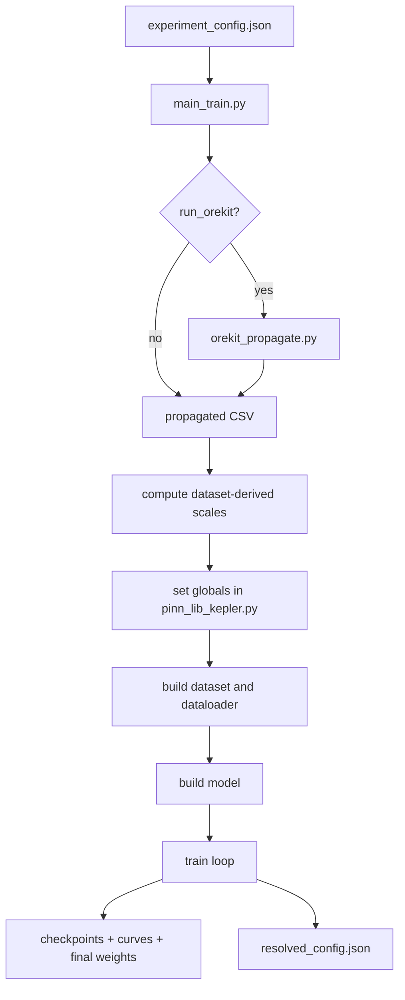

# Efficient Kepler Pipeline Notes

### What was generalized

The old setup had important values hardcoded inside training and model code, including:
- dataset paths
- Orekit propagation duration and step size
- training hyperparameters
- PDE/data loss weights
- window duration
- orbit-class-specific scaling constants like `T_SCALED_MAX` and the `7500.0` velocity normalization hack

The new setup introduces:
- `main_train.py` as the pipeline entrypoint
- `experiment_config.json` as the single source of truth for run configuration
- dataset-derived scaling for `T_SCALED_MAX` and `V0_SCALE`
- optional automated Orekit propagation before training
- resolved config saving for reproducibility

### What was made more efficient

The current efficiency refactor does **not** yet implement the full first-order PINN formulation.

What it **does** implement is the most useful drop-in optimization without breaking the current model design:

- split the forward pass into two paths:
  - **data path**: compute only `r(t)` and `v(t)`
  - **physics path**: compute `r(t)`, `v(t)`, and `a(t)`
- avoid computing the second derivative for the supervised data branch
- keep `create_graph=True` only where it must remain enabled during training
- remove hardcoded `7500.0` and replace it with configurable `V0_SCALE`

This preserves the current Kepler-baseline residual architecture while reducing avoidable autograd cost.

---

## Current High-Level Pipeline



---

## Files and Responsibilities

### `main_train.py`
Pipeline entrypoint.

Responsibilities:
- read JSON config
- set seeds
- optionally call `orekit_propagate.py`
- compute dataset-driven scales
- push resolved settings into `pinn_lib_kepler.py`
- build dataloader, model, optimizer, scheduler
- run training, diagnostics, checkpointing, and saving

### `experiment_config.json`
Centralized config file.

Responsibilities:
- paths
- propagation options
- data/window settings
- model settings
- physics toggles
- environment constants
- training hyperparameters
- scheduler settings
- saving/checkpoint settings

### `pinn_lib_kepler.py`
Model definition and training loss logic.

Responsibilities:
- Kepler and Kepler+J2 baselines
- neural residual model
- scaling logic
- time derivatives via autograd
- data loss and physics loss
- inference helpers

### `orekit_propagate.py`
Truth-data generator.

Responsibilities:
- take initial conditions CSV
- propagate with Orekit
- write propagated truth CSV

---

## What Changed in the Pipeline

## 1. Configuration was centralized

Instead of editing constants directly inside `train.py` or `pinn_lib_kepler.py`, the new pipeline reads everything from `experiment_config.json`.

Typical config groups:
- `paths`
- `pipeline`
- `propagation`
- `data`
- `model`
- `physics`
- `environment`
- `training`
- `scheduler`
- `saving`

This makes the project:
- easier to reproduce
- easier to compare experiments
- easier to switch between LEO/GEO or future datasets
- easier to later plug into sweep tooling

---

## 2. Orekit was integrated into the training pipeline

Before the refactor, truth generation and training were effectively separate manual stages.

Now:
- `main_train.py` can optionally run `orekit_propagate.py`
- the generated propagated CSV becomes the training source
- propagation can be skipped or reused if the file already exists

This turns the workflow into a proper pipeline:

```text
IC CSV -> Orekit truth CSV -> training dataset -> model training
```

---

## 3. Scaling constants were generalized

### Old behavior

Two important quantities were effectively orbit-class hacks:
- `T_SCALED_MAX = 8.8` for LEO-style timing
- `V0 / 7500.0` as a rough LEO velocity normalization

These values do not generalize well across orbit families.

### New behavior

`main_train.py` now computes robust dataset-derived scales from the propagated CSV:
- median radius norm
- median velocity norm
- median time scale

Definitions:

```text
R_med  = median(||r||)
V_med  = median(||v||)
T0_med = median(||r|| / ||v||)
T_SCALED_MAX = window_duration_sec / T0_med
V0_SCALE = V_med
```

This means:
- no more hardcoded LEO/GEO special values
- the model adapts scaling to the actual dataset
- scaling is now reproducible and inspectable

These resolved values are also saved to `resolved_config.json`.

---

## 4. Reproducibility was improved

`main_train.py` now includes:
- Python seed
- NumPy seed
- PyTorch seed
- CUDA seed
- worker seeding for DataLoader workers

This is important because randomness comes from multiple sources:
- Python `random`
- NumPy sampling in dataset logic
- PyTorch initialization and training
- CUDA kernels and worker processes

This does **not** guarantee perfect bitwise determinism in all cases, but it is the correct reproducibility setup for the current pipeline.

---

## Current Model Formulation

The current model is still a **Kepler-baseline residual model** with a hard constraint.

The final predicted position is:

```math
r(t) = r_{\text{kepler}}(t) + \left(\frac{t}{T_{\text{scaled,max}}}\right)^3 N_\theta(t, x_0, u_0)
```

where:
- `r_kepler(t)` is the baseline propagator
- `N_theta(...)` is the neural residual correction
- the cubic gate forces the correction to be zero at `t = 0`

So the network does **not** learn the full orbit from scratch.
It learns a correction on top of the baseline.

---

## Efficiency Changes Implemented

## 1. Shared forward path was introduced

A new helper was added:

- `_forward_scaled_position(...)`

Purpose:
- perform the common work once
- compute scaled inputs
- run the neural residual network
- compute the Kepler baseline
- combine them into final scaled position

This shared helper is now used by both the data branch and the physics branch.

### Why this matters

Previously, the code path bundled position, velocity, and acceleration work together more tightly.
The new structure makes the derivative cost explicit and controllable.

---

## 2. The training forward pass was split into two functions

### A. `get_scaled_state_rv(...)`
Used for the **supervised data branch**.

Computes only:
- position `r(t)`
- velocity `v(t)`

Skips:
- acceleration `a(t)`

### B. `get_scaled_state(...)`
Used for the **physics/PDE branch**.

Computes:
- position `r(t)`
- velocity `v(t)`
- acceleration `a(t)`

### Why this matters

The data loss uses only:
- position error
- velocity error

It does **not** use acceleration.

So computing a second derivative there was wasted work.

This split removes that unnecessary cost.

---

## 3. The data loss path no longer computes second derivatives

### Old conceptual path

```text
r(t) -> dr/dt -> d²r/dt²
```

This happened even for the supervised branch where only `r` and `v` were needed.

### New conceptual path

For the data branch:

```text
r(t) -> dr/dt
```

For the physics branch:

```text
r(t) -> dr/dt -> d²r/dt²
```

### Practical effect

This reduces:
- graph size
- derivative work
- memory consumption
- unnecessary autograd overhead

while preserving the current loss behavior.

---

## 4. Time-derivative helpers were clarified

The refactor introduced:
- `_time_derivative(...)`
- `_time_derivatives(..., need_acceleration=True, create_graph=True)`

This makes the derivative logic explicit.

### `_time_derivative(...)`
Computes:

```math
\frac{d y(t)}{dt}
```

for a vector-valued output.

### `_time_derivatives(...)`
Computes:
- first derivative always
- second derivative only if `need_acceleration=True`

This is the core mechanism that enables the branch split.

---

## 5. `create_graph=False` was not blindly forced

One of the original efficiency questions was whether `create_graph=False` could be set inside the time-autograd helper.

### Answer

Only in limited situations.

### Why not everywhere?

During training:
- velocity participates in the supervised loss
- acceleration participates in the PDE loss

So derivatives must still remain connected to the graph.

If `create_graph=False` is used during a derivative that appears inside the loss, gradients will not correctly flow back to the network parameters.

### Safe usage

`create_graph=False` is safe only in derivative computations that are used for:
- inference
- diagnostics
- evaluation without gradient backpropagation through that derivative

### Final decision in the implemented refactor

- keep `create_graph=True` during training derivative paths
- use the branch split to reduce cost safely
- do not break the gradient path needed for learning

This is the correct compromise for the current architecture.

---

## 6. Hardcoded velocity normalization was removed

Old pattern:

```python
V0_scaled_in = V0 / 7500.0
```

New pattern:

```python
V0_scaled_in = V0 / V0_SCALE
```

`V0_SCALE` is now provided by config or derived from the dataset.

### Why this matters

The old value assumed a LEO-like orbital speed scale.
That is brittle.

The new approach makes the model:
- orbit-agnostic
- easier to reuse
- easier to interpret

---

## Exactly How the Loss Changed

## Before

The code effectively used the same state function for both:
- supervised data points
- PDE collocation points

Even if acceleration was not needed in the data loss path.

## After

### Data branch

Uses:
- `get_scaled_state_rv(...)`

Then computes:

```math
L_{data} = \text{MSE}\left(\frac{r_{pred} - r_{truth}}{R_0}\right) + \text{MSE}\left(\frac{v_{pred} - v_{truth}}{V_0}\right)
```

### Physics branch

Uses:
- `get_scaled_state(...)`

Then computes the normalized acceleration residual:

```math
L_{pde} = \text{MSE}\left(\frac{a_{pred} - a_{phys}}{||a_{phys}|| + ||a_{pred}|| + \epsilon}\right)
```

### Total loss

```math
L = W_{DATA} L_{data} + W_{PDE} L_{pde}
```

This preserves the current training objective while reducing unnecessary derivative cost on the data side.
---

# Workflow 

This directory contains the training, inference, and trajectory-plotting workflow for the generalist Kepler PINN.

The main entry points are:

- `train_opti.py`: train or resume a model.
- `inference_plot_osc2mean.py`: evaluate every satellite and generate statistics, scatter plots, heatmaps, and optional per-satellite plots.
- `fast_3d_and_error_plotting.py`: generate 3D, component, and error plots for selected satellites.
- `train_and_plot.sh`: train and automatically run both plotting programs.
- `plot_checkpoint.sh`: run both plotting programs from an existing checkpoint.

## Requirements

The standard workflow requires:

- Python 3.9 or newer
- NumPy
- pandas
- PyTorch
- Matplotlib

PennyLane is optional and is only required for `--use-quantum-input` or
`--use-quantum-hidden`.

Orekit and its data files are additionally required when evaluating unseen satellites that only have an initial state.

Run commands from this directory:

```bash
cd /home/dhamu/updated_model/along_track_error_resolved
```

Use `python3` rather than `python` if the server does not provide a `python` command.

## CSV format

Both training and inference CSV files must contain these columns:

```text
satellite
timestamp
x_eme2000_km
y_eme2000_km
z_eme2000_km
vx_eme2000_km_s
vy_eme2000_km_s
vz_eme2000_km_s
```

Two data layouts are supported:

1. Propagated CSV: multiple timestamps per satellite. The CSV positions are used as truth.
2. Unseen initial-condition CSV: one state per satellite. Orekit J2 generates the truth trajectory.

## Model input configurations

The base input width is 9: scaled time, initial position and velocity, `R0`,
and `V0`. Optional blocks add:

- 2 latitude inputs: `z/r` and `(z/r)²`.
- 3 static orbit inputs: `cos(i)`, `sin²(i)`, and eccentricity.
- Optionally, `2N` orbit-phase inputs: `sin(ku), cos(ku)` for harmonics
  `k=1..N`. Use `--no-use-orbit-phase-features` to keep only the three
  static descriptors.
- `2K` Fourier time inputs based on the per-satellite orbital phase.

The total width is `9 + latitude(2) + orbit(3 [+ 2N]) + Fourier(2K)`.
Structured checkpoints store all flags, widths, regime, physics settings, and
network type. Legacy raw checkpoints remain supported for the original widths
9, 11, 14, and 16.

## Training

### Standard training

Training defaults to 1200 epochs:

```bash
python3 train_opti.py \
  --data "/home/dhamu/updated_model/data/propagated_80k.csv" \
  --output-dir "/home/dhamu/updated_model/runs/standard_model"
```

### 14-input tanh-gate model

This preset enables the J2 baseline, osc2mean correction, five orbit features, quadratic setting, and the orbit-relative tanh gate:

```bash
python3 train_opti.py \
  --data "/home/dhamu/updated_model/data/propagated_40k.csv" \
  --output-dir "/home/dhamu/updated_model/runs/orbitfeat_tanh_40k" \
  --epochs 1200 \
  --window-duration 40000 \
  --use-j2-baseline \
  --use-osc2mean \
  --no-use-lat-features \
  --use-orbit-features \
  --per-sample-gate \
  --gate-power 2.0 \
  --gate-kind tanh \
  --gate-tau-div 3.0
```

### Custom training size and learning settings

```bash
python3 train_opti.py \
  --data "/home/dhamu/updated_model/data/propagated_40k.csv" \
  --output-dir "/home/dhamu/updated_model/runs/custom_run" \
  --epochs 2000 \
  --batch-size 32 \
  --samples-per-epoch 12000 \
  --window-duration 40000 \
  --learning-rate 0.0001 \
  --checkpoint-every 50 \
  --w-data 1.0 \
  --w-pde 0.0
```

### Generalized harmonic and Fourier model

```bash
python3 train_opti.py \
  --data "/home/dhamu/updated_model/data/propagated_80k.csv" \
  --output-dir "/home/dhamu/updated_model/runs/generalized" \
  --regime LEO \
  --use-j2-baseline \
  --use-osc2mean \
  --use-orbit-features \
  --orbit-harmonics 3 \
  --use-fourier-time \
  --fourier-n-freqs 4 \
  --fourier-spacing integer \
  --gate-kind tanh
```

Use `--use-j2-physics` when enabling a nonzero `--w-pde`. Architecture size
is configurable with `--width` and `--depth`.

### Resume training

`--epochs` is the final target epoch. For example, if the checkpoint is at epoch 800, this command continues through epoch 1450:

```bash
python3 train_opti.py \
  --data "/home/dhamu/updated_model/data/propagated_40k.csv" \
  --output-dir "/home/dhamu/updated_model/runs/orbitfeat_tanh_40k" \
  --resume "/home/dhamu/updated_model/runs/orbitfeat_tanh_40k/checkpoints/epoch_0800.pth" \
  --epochs 1450 \
  --window-duration 40000 \
  --use-j2-baseline \
  --use-osc2mean \
  --no-use-lat-features \
  --use-orbit-features \
  --per-sample-gate \
  --gate-power 2.0 \
  --gate-kind tanh \
  --gate-tau-div 3.0
```

Training writes:

```text
run-directory/
├── config.json
├── latest.pth
├── loss_curves.png
└── checkpoints/
    ├── epoch_0050.pth
    ├── epoch_0100.pth
    └── ...
```

If training is interrupted with Ctrl+C, the current state is saved as `latest.pth`.

## Train and plot automatically

The shell workflow trains for 1200 epochs by default, runs inference, and creates selected trajectory plots:

```bash
./train_and_plot.sh \
  "/home/dhamu/updated_model/data/propagated_40k.csv" \
  "/home/dhamu/updated_model/runs/orbitfeat_tanh_40k" \
  1200 \
  --window-duration 40000 \
  --use-j2-baseline \
  --use-osc2mean \
  --no-use-lat-features \
  --use-orbit-features \
  --per-sample-gate \
  --gate-power 2.0 \
  --gate-kind tanh \
  --gate-tau-div 3.0
```

Set the number of randomly selected 3D plots with an environment variable:

```bash
PLOT_SATELLITES=10 ./train_and_plot.sh \
  "/home/dhamu/updated_model/data/propagated_40k.csv" \
  "/home/dhamu/updated_model/runs/model_run" \
  1200
```

`TRUTH_SOURCE`, `PLOT_HORIZON`, and `PLOT_POINTS` can also be set for the two
automatic plotting steps.

## Four 40K training experiments

The portable launcher discovers the `tap-lab` directory from its own location
and defaults to `data/LEO_739/propagated_40k_10stp.csv`. It does not depend on
the VM username or `/home` path. It prints every enabled feature, expected
input width, resolved dataset, and exact command before starting:

```bash
./run_40k_experiments.sh EXPERIMENT [DATA_40K_CSV|auto] [OUTPUT_ROOT] [EPOCHS]
```

Run one configuration per VM:

```bash
./run_40k_experiments.sh 1
./run_40k_experiments.sh 2
./run_40k_experiments.sh 3
./run_40k_experiments.sh 4
```

To set the output directory and epoch count while retaining automatic dataset
discovery:

```bash
./run_40k_experiments.sh 1 auto runs_40k 1200
```

Use `all` to run them sequentially. Check commands without training using:

```bash
DRY_RUN=1 ./run_40k_experiments.sh all
```

The launcher performs a trainer-capability check before training. Experiments
1–3 remain compatible with trainers where orbit-phase harmonics are the
implicit default. Experiment 4 requires the explicit
`--no-use-orbit-phase-features` support; if it is missing, update the launcher,
trainer, PINN library, and inference files together rather than mixing file
versions from different revisions.

Experiment 3 defaults to four PDE collocation points per satellite and
`W_PDE=0.01`. Override them per VM with, for example,
`PDE_POINTS=8 W_PDE=0.005`.

After training, evaluate the matching checkpoint against the propagated 40K
CSV with:

```bash
./evaluate_40k_experiments.sh 1
./evaluate_40k_experiments.sh all auto runs_40k 4001
```

## Inference

`--truth-source` supports three modes:

- `csv`: require multiple timestamps and compare against the propagated CSV.
- `orekit`: propagate every initial state using Orekit J2.
- `auto`: use CSV truth when multiple timestamps exist; otherwise use Orekit.

### Propagated training or test CSV

```bash
python3 inference_plot_osc2mean.py \
  --checkpoint "/home/dhamu/updated_model/models/orbitfeat_tanh_40k/1450.pth" \
  --data "/home/dhamu/updated_model/data/propagated_40k.csv" \
  --output-dir "/home/dhamu/updated_model/plots/propagated_results" \
  --truth-source csv \
  --horizon 40000 \
  --points 4001 \
  --use-j2-baseline \
  --use-osc2mean \
  --no-use-lat-features \
  --use-orbit-features \
  --per-sample-gate \
  --gate-power 2.0 \
  --gate-kind tanh \
  --gate-tau-div 3.0
```

### Unseen one-row-per-satellite CSV with Orekit truth

```bash
python3 inference_plot_osc2mean.py \
  --checkpoint "/home/dhamu/updated_model/models/orbitfeat_tanh_40k/1450.pth" \
  --data "/home/dhamu/updated_model/data/LEO_Performance.csv" \
  --output-dir "/home/dhamu/updated_model/plots/unseen_orekit_results" \
  --truth-source orekit \
  --horizon 40000 \
  --points 4001 \
  --use-j2-baseline \
  --use-osc2mean \
  --no-use-lat-features \
  --use-orbit-features \
  --per-sample-gate \
  --gate-power 2.0 \
  --gate-kind tanh \
  --gate-tau-div 3.0 \
  --make-propagation-plots
```

### Automatic CSV or Orekit selection

This is useful when the data layout is not known in advance:

```bash
python3 inference_plot_osc2mean.py \
  --checkpoint "/home/dhamu/updated_model/models/model.pth" \
  --data "/home/dhamu/updated_model/data/evaluation.csv" \
  --output-dir "/home/dhamu/updated_model/plots/automatic_results" \
  --truth-source auto \
  --horizon 40000 \
  --points 4001
```

For an old raw checkpoint, include all physics and gate flags explicitly.

### Evaluate only a sample of satellites

```bash
python3 inference_plot_osc2mean.py \
  --checkpoint "/home/dhamu/updated_model/models/model.pth" \
  --data "/home/dhamu/updated_model/data/evaluation.csv" \
  --output-dir "/home/dhamu/updated_model/plots/sample_results" \
  --truth-source auto \
  --horizon 40000 \
  --points 4001 \
  --max-satellites 20 \
  --seed 42
```

Inference writes:

```text
output-directory/
├── inference_metrics.csv
├── inference_scatter.png
├── inference_heatmap.png
└── sat_47/
    ├── stats.txt
    ├── 01_3d.png
    ├── 02_components.png
    └── 03_deviation.png
```

The three per-satellite PNG files are created when `--make-propagation-plots` is supplied. The statistics files are always created.

## Fast 3D and error plotting

### Random satellites from saved inference statistics

```bash
python3 fast_3d_and_error_plotting.py \
  --checkpoint "/home/dhamu/updated_model/models/orbitfeat_tanh_40k/1450.pth" \
  --data "/home/dhamu/updated_model/data/LEO_Performance.csv" \
  --stats-dir "/home/dhamu/updated_model/plots/unseen_orekit_results" \
  --output-dir "/home/dhamu/updated_model/plots/selected_3d" \
  --truth-source orekit \
  --horizon 40000 \
  --points 4001 \
  --count 6 \
  --seed 42 \
  --use-j2-baseline \
  --use-osc2mean \
  --no-use-lat-features \
  --use-orbit-features \
  --per-sample-gate \
  --gate-power 2.0 \
  --gate-kind tanh \
  --gate-tau-div 3.0
```

### Specific satellites

```bash
python3 fast_3d_and_error_plotting.py \
  --checkpoint "/home/dhamu/updated_model/models/orbitfeat_tanh_40k/1450.pth" \
  --data "/home/dhamu/updated_model/data/LEO_Performance.csv" \
  --output-dir "/home/dhamu/updated_model/plots/specific_satellites" \
  --satellites 47 123 456 \
  --truth-source orekit \
  --horizon 40000 \
  --points 4001 \
  --use-j2-baseline \
  --use-osc2mean \
  --no-use-lat-features \
  --use-orbit-features \
  --per-sample-gate \
  --gate-power 2.0 \
  --gate-kind tanh \
  --gate-tau-div 3.0
```

### Propagated CSV truth

```bash
python3 fast_3d_and_error_plotting.py \
  --checkpoint "/home/dhamu/updated_model/models/model.pth" \
  --data "/home/dhamu/updated_model/data/propagated_40k.csv" \
  --output-dir "/home/dhamu/updated_model/plots/csv_3d" \
  --truth-source csv \
  --horizon 40000 \
  --points 4001 \
  --count 6
```

The fast plotter produces, for every selected satellite:

- `sat_ID_3d.png`
- `sat_ID_components.png`
- `sat_ID_error.png`

## Plot an existing checkpoint with one shell command

For propagated CSV data:

```bash
./plot_checkpoint.sh \
  "/home/dhamu/updated_model/models/model.pth" \
  "/home/dhamu/updated_model/data/propagated_40k.csv" \
  "/home/dhamu/updated_model/plots/checkpoint_results" \
  40000 \
  csv
```

For unseen initial conditions with Orekit:

```bash
./plot_checkpoint.sh \
  "/home/dhamu/updated_model/models/model.pth" \
  "/home/dhamu/updated_model/data/LEO_Performance.csv" \
  "/home/dhamu/updated_model/plots/checkpoint_orekit_results" \
  40000 \
  orekit
```

The positional arguments are:

```text
plot_checkpoint.sh CHECKPOINT DATA_CSV [OUTPUT_DIR] [HORIZON] [TRUTH_SOURCE] [POINTS]
```

This shell command relies on checkpoint metadata. When using an old raw checkpoint with configuration flags that cannot be inferred from its weights, run the Python inference and plotting commands explicitly.

## Unified numerical PINN experimentation framework

`unified_pinn_lab.py` now provides checkpoint evaluation, rapid retraining sweeps, feature ablation, and physics-loss probing through one command-line program.

### Discover datasets, libraries, and checkpoints

```bash
python3 unified_pinn_lab.py discover \
  --root "/home/dhamu/updated_model"
```

### Evaluate a trained checkpoint

```bash
python3 unified_pinn_lab.py evaluate \
  --root "/home/dhamu/updated_model" \
  --dataset "/home/dhamu/updated_model/data/propagated_40k.csv" \
  --library "/home/dhamu/updated_model/along_track_error_resolved/pinn_lib_kepler.py" \
  --checkpoint "/home/dhamu/updated_model/models/model.pth" \
  --output "/home/dhamu/updated_model/experiments/checkpoint_evaluation" \
  --horizon 40000
```

### Rapid PINN configuration sweep

```bash
python3 unified_pinn_lab.py sweep \
  --root "/home/dhamu/updated_model" \
  --dataset "/home/dhamu/updated_model/data/propagated_40k.csv" \
  --library "/home/dhamu/updated_model/along_track_error_resolved/pinn_lib_kepler.py" \
  --output "/home/dhamu/updated_model/experiments/rapid_sweep" \
  --horizon 40000 \
  --sweep-preset j2 \
  --epochs 400 \
  --train-sats 200 \
  --val-sats 60
```

### Feature ablation only

```bash
python3 unified_pinn_lab.py feature-ablation \
  --data "/home/dhamu/updated_model/data/propagated_40k.csv" \
  --library "/home/dhamu/updated_model/along_track_error_resolved/pinn_lib_kepler.py" \
  --output-dir "/home/dhamu/updated_model/experiments/feature_ablation" \
  --horizon 40000 \
  --max-satellites 400 \
  --points-per-satellite 400
```

This calculates how much of the analytical baseline residual is explained by static orbital properties, latitude, and first through fourth orbital harmonics.

### Physics-loss probe only

```bash
python3 unified_pinn_lab.py physics-probe \
  --data "/home/dhamu/updated_model/data/propagated_40k.csv" \
  --library "/home/dhamu/updated_model/along_track_error_resolved/pinn_lib_kepler.py" \
  --output-dir "/home/dhamu/updated_model/experiments/physics_probe" \
  --horizon 40000 \
  --max-satellites 400 \
  --physics-points-per-satellite 200
```

The physics probe trains paired proxy networks and can be considerably slower than feature ablation.

### Complete feature and physics ablation experiment

```bash
python3 unified_pinn_lab.py ablation \
  --data "/home/dhamu/updated_model/data/propagated_40k.csv" \
  --library "/home/dhamu/updated_model/along_track_error_resolved/pinn_lib_kepler.py" \
  --output-dir "/home/dhamu/updated_model/experiments/complete_ablation" \
  --horizon 40000 \
  --max-satellites 400 \
  --points-per-satellite 400 \
  --physics-points-per-satellite 200 \
  --seed 42
```

The combined output is organized as:

```text
complete_ablation/
├── framework_manifest.json
├── feature_ablation/
│   ├── summary.csv
│   ├── per_satellite.csv
│   ├── by_inclination.csv
│   ├── report.txt
│   └── manifest.json
└── physics_probe/
    ├── alignment.csv
    ├── ab_training.csv
    ├── ab_training_per_seed.csv
    ├── report.txt
    └── manifest.json
```

Custom ablation configurations can be supplied with `--feature-config` and `--physics-config`. When omitted, the JSON configurations in `run_ablation/` are used.

### Run checkpoint evaluation and rapid sweep together

```bash
python3 unified_pinn_lab.py all \
  --root "/home/dhamu/updated_model" \
  --dataset "/home/dhamu/updated_model/data/propagated_40k.csv" \
  --library "/home/dhamu/updated_model/along_track_error_resolved/pinn_lib_kepler.py" \
  --checkpoint "/home/dhamu/updated_model/models/model.pth" \
  --output "/home/dhamu/updated_model/experiments/evaluation_and_sweep" \
  --horizon 40000
```

The `all` command retains its original meaning: checkpoint evaluation plus rapid retraining. The `ablation` command runs feature ablation plus physics probing.

## Useful help commands

Every Python entry point provides its complete option list:

```bash
python3 train_opti.py --help
python3 inference_plot_osc2mean.py --help
python3 fast_3d_and_error_plotting.py --help
python3 unified_pinn_lab.py --help
python3 unified_pinn_lab.py ablation --help
```

## Important configuration rule

Inference must use the same model configuration as training. In particular, keep these settings consistent:

- J2 baseline
- osc2mean correction
- latitude features
- orbit features
- orbit harmonic count
- Fourier time settings
- orbital regime
- gate kind
- gate power
- tau divisor
- per-sample gate setting
- quantum architecture (when enabled)

Structured checkpoints created by `train_opti.py` store these values automatically. Explicit flags are recommended when evaluating an older raw `.pth` checkpoint.
